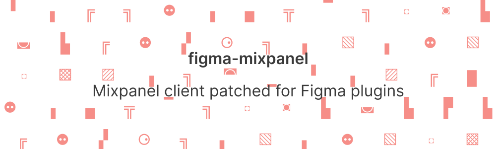

# 

## Problem
Original Mixpanel client will **NOT** work in Figma plugins UI.

**Why?**  
Electron limitation when Iframe content is loaded as Data-URI. Both `localStorage` and `document.cookie` are not available ([similar problem](https://stackoverflow.com/questions/44973467/electron-browserwindow-facebook-login-failed-to-set-cookies)).

Mixpanel client has configuration option to switch off persistance `disable_persistence`, but it won't help, as it accesses `cookie`, which  crashes the client 🤷‍♂️.

## Fix
Patch the original file to not access `document.cookie`/`localStorage`.

Original file - [mixpanel/mixpanel-js](https://github.com/mixpanel/mixpanel-js/blob/1c4d98b4a485fbf4dc4421f00c33f3b19530b307/dist/mixpanel.cjs.js)
Patched file – [mixpanel.patched.js](mixpanel.patched.js)

## Bonus points. Size reduction.
Mixpanel client is a HUGE file (~250kb) and team is [not addressing it](https://github.com/mixpanel/mixpanel-js/issues/128).

So I stripped file to make it much smaller.

If size does not bother you or something you need was removed – use `npm i figma-mixpanel@1.0.0` or [raw file](https://github.com/okotoki/figma-mixpanel/blob/master/mixpanel.patched.js) ([diff](https://github.com/okotoki/figma-mixpanel/commit/3c161fb714fd6bab1c21b9f3aea48c5f2e0a0f43))

## Usage

Installation
```sh
npm i figma-mixpanel
# or using Yarn
yarn add figma-mixpanel
```

Import package and use client as you usually would.
```typescript
// main.ts
import * as mixpanel from 'figma-messenger'

// disabling via config just in case
mixpanel.init(YOUR_MIXPANEL_KEY, {
  disable_cookie: true,
  disable_persistence: true
})

```

## `identify` support

Since there is no persistance – every time someone opens your plugin Mixpanel would assume it a unique visitor/user.

To fix that, generate user_id for persistance on main thread side and store it in plugin settings.

**CAVEAT** Figma plugin settings are tied to Figma instance, so if user uses desktop app on 2 laptops – it will be treated as 2 different users.

```typescript 
// main.ts

const getUserId = async () => {
  let userId = uuid()

  try {
    const id = await figma.clientStorage.getAsync('userId')

    if (typeof id === 'undefined') {
      figma.clientStorage.setAsync('userId', userId)
    } else {
      userId = id
    }
  } catch (e) {
    console.error('userId retrieving error', e)
    figma.clientStorage.setAsync('userId', userId)
  }

  return userId
}
// get or set if not yet set.
const userId = await getUserId(
// send to iframe
figma.ui.sendMessage(userId)


// iframe.ts

// receive userId from main thread and call identify
mixpanel.identify(userId)
```

## License
Apache 2.0
